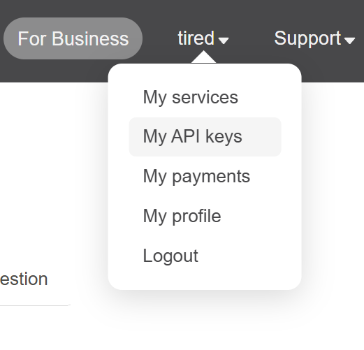
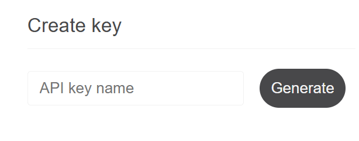
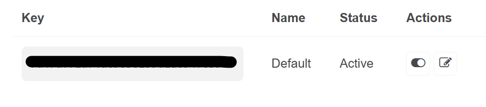

# ☀️☁️Weather App

A real-time weather python application 


## Table of Contents
- [Features](#features)
- [Preview](#preview)
- [Getting Started](#getting-started)
- [Technologies Used](#technologies-used)

## Features

### 🌇Real-time Weather
Access current weather conditions for over 10,000 cities and locations worldwide
### ⛅Weather Icons
Easy to understand icons for quick weather lookup
### 🗒️Weather Descriptions
Clear, concise summaries that give you context beyond just temperature—including humidity, wind conditions, and atmospheric details.
### ❌Error Handling
Custom error management with informative messages for failed weather requests.

## Preview

 


## Getting Started
This project requires the **PyQt5** & **requests** modules.

To install, run the following commands in your project terminal
```bash
    pip install PyQt5
    pip install requests
```

For reference, this project was built using **PyQt5 v5.15.11** and **requests v2.32.4**

To check the versions, run 
```bash
    pip show PyQt5
    pip show requests
```

### Steps

1. Clone the repository.
   ```bash
   git clone https://github.com/thetireddude/weatherApp.git
   ```
   You can also download the project zip file.


2. Open the project folder in PyCharm.

3. Navigate to line `96` in the `main.py` file

4. You need paste your Open Weather API key. To get your own API key, visit https://openweathermap.org/api

5. Click the **Sign in/ Sign up** buttom in the top right corner

6. After logging into your account, navigate to your `{account} --> My API keys` in the top right
<br><br>

7. Under **Create Key** click **Generate** to get your API key
<br><br>

8. Once you get your key, copy your key. Make sure that the key is **Active**
<br><br>

9. After pasting your API key, simply run the `main.py` file.
<br><br>

### Packaging The Project

To learn how to package the weather app as an executable Windows Installer, visit:
https://www.pythonguis.com/tutorials/packaging-pyqt5-pyside2-applications-windows-pyinstaller


## Technologies Used

### Frontend
- Python 
- PyQt5

### Backend
- Requests module
- OpenWeather API

### Tools & Services
- Git & GitHub
- PyCharm

---

⭐ If you found this project helpful, please give it a star on GitHub!


